# kigo-core

Pubsub shema for communication with `KiGo` and `KiGoUI`.

## Communication

### Orders

Orders are messages sended by KiGo and modules to the modules. The modules should react to them.

- `OrderStartUp` is called after receiving the notification `NotificationReady` from the module and gives the module basic information about the current state of KiGo
- `OrderError` is called when an error occurs on the KiGo side which is caused by the module
- `OrderInformation` is called when an update is send which contains information about the general system
- `OrderChange` is called when an update is send to change the module
- `OrderShutdown` should free up the resources and shutdown
- `OrderRender` render to the location

### Notifications

Notification are messages sended by the modules to `KiGo`.

- `NotificationReady` is called when the module is ready to communicate
- `NotificationUpdate` is called when an update is happened

#### NotificationUpdate

Currently reasons for an update:
- `Config` is 0 - change module configuration

### Inquiries

- `InquiryInformation` is called when an information is required, responded with `OrderInformation`
- `InquiryRender` is called to render. Send to `KiGoUI`, responded with `OrderRender`

#### InquiryInformations

Currently reasons for an inquiry:
- `Modules` is 0 - receive all modules information
- `Module` is 1 - receive information about the module with the given name or ID

### Changes

Changes are messages which can be sended to modules to change the internal status. They are attached to `OrderChanges`. They cause a change in the state of the module which causes a redraw.

## Module lifecycle

Modules are in a initiating period before they send `NotificationReady`. They can choose a heartbeat which is smaller than 24 hours or leave it empty. If empty skip everything, we assume a module which do not draw anything to `KiGoUI`
`KiGo` response with `OrderStartUp`. From this point on a constant heartbeat is been send to make sure the module is still alive. The heartbeat is responded by initiating communication with `KiGo` or `KiGoUI`. If the heartbeat is not responded a `OrderShutdown` is been called and, if the module has drawn, the widget of the module is been removed.
`KiGo` accepts `InquiryInformations` and `NotificationUpdate`. `KiGoUI` accepts `InquiryRender`. The loop of heartbeat required the module to do anything, may it be to render something or any logic, instead of just aquiring resources.

## KiGoUI

Modules on the device can communication with `KiGoUI` is via pubsub, this keeps the latence low. Remote devices need to communicate via REST over `KiGo`, which is implemented on Phase 5. `KiGo` communicates to `KiGoUI` for remote modules (**TBD**) and for sending clean up calls. ** . `KiGoUI` only communicates to `KiGo` to refresh to signalize an interaction aka refresh the heartbeat.
The module has the initial informations about the screen, like width, height, supported formats and max fps which it got from `OrderStartUp`. `InquiryRender` is send to `KiGoUI` in preparation for data transfer. The module gives information about where to draw, the refresh rate and the transfer method. `KiGoUI` sends a trigger to refresh the heartbeat to `KiGo` and creates a ringbuffer for this transmission. The `OrderRender` is send with the location of the ringbuffer. From this point on `KiGoUI` listen to the ringbuffer.
The module is than sending each frame through the ringbuffer and `KiGoUI` renders it.

** Therefore `KiGoUI` keeps track of which module draws OR the module is responsible for cleaning up. **TBD**

The whole animation is currently not saved on `KiGoUI` (TBD)

### Channels

Before choosing which channels to use to transfer data ackknowledge the size and the throughput needed to be smooth.

IPC -> For on device and high throuput module IPC is the standard.
NATS -> Nats saves message to memory and has a default limit of 1 MB. Increasing the limit enabled it as channel in local network as long as encoding methods are used.
REST -> For modules outside of the local network.

### Methods

KiGoUI is not responsible for ensuring a minimum fps. Here are the estimated FPS per method and channel.

FullHD

| Encoding Method      | IPC (Shared Mem) | PubSub (NATS) | REST (HTTP/2) | Primary Bottleneck             |
| -------------------- | ---------------- | ------------- | ------------- | ------------------------------ |
| RAW (RGB/YUV)        | ~300–660 fps     | ~60–120 fps   | ~30–60 fps    | Memory bandwidth               |
| JPEG                 | ~60 fps          | ~50–60 fps    | ~25–40 fps    | JPEG VPU limit                 |
| MJPEG (intra stream) | ~60 fps          | ~50–60 fps    | ~25–40 fps    | JPEG encoder throughput        |
| H.264 (AVC)          | ~60 fps          | ~60 fps       | ~45–60 fps    | VPU pipeline                   |
| H.265 (HEVC)         | ~50–60 fps       | ~50–60 fps    | ~40–55 fps    | HEVC complexity                |
| VP8                  | ~30–60 fps       | ~30–60 fps    | ~25–45 fps    | CPU/VPU hybrid load            |
| VP9                  | ~25–50 fps       | ~25–50 fps    | ~20–40 fps    | CPU-heavy entropy coding       |
| AV1                  | ~10–30 fps       | ~10–25 fps    | ~10–20 fps    | Extremely high compute cost    |
| MPEG-2 (legacy)      | ~80–120 fps      | ~60–100 fps   | ~40–80 fps    | Low efficiency, older pipeline |
| H.264 + SVC          | ~40–60 fps       | ~40–60 fps    | ~30–50 fps    | Layered encoding overhead      |

4K

| Encoding Method | IPC (Shared Mem) | PubSub (NATS) | REST (HTTP/2) | Primary Bottleneck               |
| --------------- | ---------------- | ------------- | ------------- | -------------------------------- |
| RAW (RGB/YUV)   | ~60–150 fps      | ~15–40 fps    | ~8–25 fps     | Memory bandwidth explosion       |
| JPEG            | ~20–30 fps       | ~15–25 fps    | ~10–20 fps    | JPEG VPU limit                   |
| MJPEG           | ~20–30 fps       | ~15–25 fps    | ~10–20 fps    | JPEG pipeline saturation         |
| H.264 (AVC)     | ~25–60 fps       | ~25–50 fps    | ~20–45 fps    | VPU macroblock processing        |
| H.265 (HEVC)    | ~20–60 fps       | ~20–45 fps    | ~15–40 fps    | HEVC entropy + motion estimation |
| VP8             | ~15–40 fps       | ~15–40 fps    | ~10–30 fps    | CPU + partial hardware           |
| VP9             | ~10–35 fps       | ~10–30 fps    | ~8–25 fps     | High CPU load                    |
| AV1             | ~5–20 fps        | ~5–15 fps     | ~5–12 fps     | Very high compute complexity     |
| MPEG-2          | ~40–80 fps       | ~30–60 fps    | ~20–50 fps    | Inefficient but lightweight      |
| H.264 + SVC     | ~20–50 fps       | ~20–45 fps    | ~15–40 fps    | Layered encoding overhead        |

Integrated:

- [ ] RAW
- [ ] JPEG
