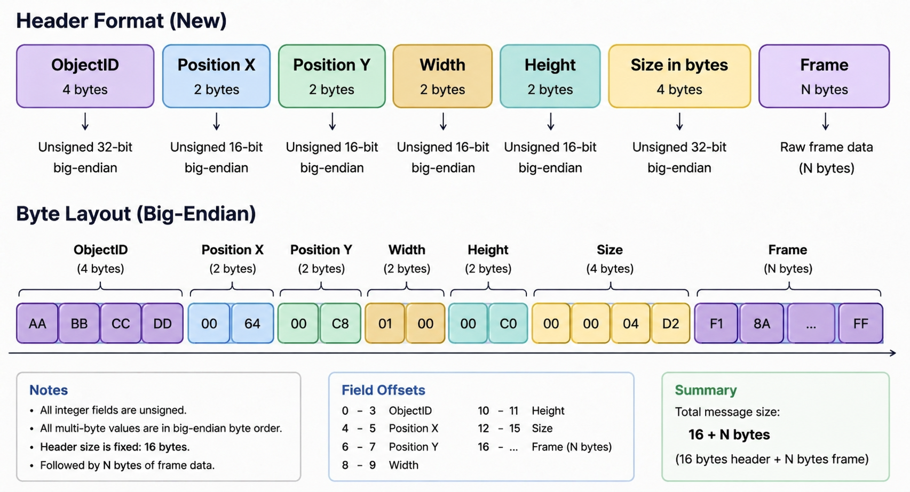

# kigo-core

Pubsub shema for communication with `KiGo` and `KiGoUI`.

## Communication

### Orders

Orders are messages sended to the modules to the modules. The modules should react to them.

- `OrderStartUp` is called after receiving the notification `NotificationReady` from the module and gives the module basic information about the current state of KiGo
- `OrderError` is called when an error occurs on the KiGo side which is caused by the module
- `OrderInformation` is called when an update is send which contains information about the general system
- `OrderChange` is called when an update is send to change the module
- `OrderShutdown` should free up the resources and shutdown
- `OrderRender` render to the location 

### Notifications

Notification are messages sended by the modules to `KiGo`.

- `NotificationReady` is called when the module is ready to communicate
- `NotificationUpdate` is called when an update is happened
- `NotificationShutdown` is called when the module shuts down themself

#### NotificationUpdate

Currently reasons for an update:
- `Config` is 0 - change module configuration

### Inquiries

- `InquiryInformation` is called when an information is required, responded with `OrderInformation` by `KiGo`and `KiGoUI`
- `InquiryRender` is called to render. Send to `KiGoUI`, responded with `OrderRender`

#### InquiryInformations

Currently reasons for an inquiry:
- `Modules` is 0 - receive all modules information - **provided by KiGo**
- `Module` is 1 - receive information about the module with the given name or ID - **provided by KiGo**
- `Screen` is 2 - information about the screen - **provided by KiGoUI**

### Changes

Changes are messages which can be sended to modules to change the internal status. They are attached to `OrderChanges`. They cause a change in the state of the module which causes a redraw.

## Module lifecycle

Modules are in a initiating period before they send `NotificationReady`. They can choose a heartbeat which is smaller than 24 hours or leave it empty. If empty skip everything, we assume a module which do not draw anything to `KiGoUI`
`KiGo` response with `OrderStartUp`. From this point on a constant heartbeat is been send to make sure the module is still alive. The heartbeat is responded by initiating communication with `KiGo` or `KiGoUI`. If the heartbeat is not responded a `OrderShutdown` is been called and, if the module has drawn, the widget of the module is been removed.
`KiGo` accepts `InquiryInformations` and `NotificationUpdate`. `KiGoUI` accepts `InquiryRender`. The loop of heartbeat required the module to do anything, may it be to render something or any logic, instead of just aquiring resources.

## KiGoUI

Modules on the device can communication with `KiGoUI` is via pubsub, this keeps the latence low. Remote devices need to communicate via REST over `KiGo`, which is implemented on Phase 5. `KiGoUI` only communicates to `KiGo` to refresh the heartbeat of the module.
The module has the initial informations about the screen, like width, height, supported formats and max fps which it got from `OrderStartUp`. `InquiryRender` is send to `KiGoUI` in preparation for data transfer. The module gives information about where to draw, the refresh rate and the transfer method. `KiGoUI` sends a trigger to refresh the heartbeat to `KiGo` and creates a ringbuffer for this transmission. The `OrderRender` is send with the location of the ringbuffer. From this point on `KiGoUI` listen to the ringbuffer.
The module is than sending each frame through the ringbuffer and `KiGoUI` renders it.

- 1 - Ask for channel and render option
- 2 - `KiGoUI` refreshes heartbeat
- 3 - Ringbuffer is created
- 4 - Channel and render options are sended back
- 5 - Listens to channel
- 6 - renders whatever is send

### Channels

Before choosing which channels to use to transfer data ackknowledge the size and the throughput needed to be smooth.

- [X] IPC -> For on device and high throuput module IPC is the standard.
- [X] NATS -> Nats saves message to memory and has a default limit of 1 MB. Increasing the limit enabled it as channel in local network as long as encoding methods are used.
- [ ] REST -> For modules outside of the local network.

### Formats

KiGoUI is not responsible for ensuring a minimum fps. Here are the estimated FPS per format and channel.

FullHD

| Encoding       | IPC (Shared Memory) | PubSub (NATS) | REST (HTTP/2) | Main Bottleneck                          |
| -------------- | ------------------: | ------------: | ------------: | ---------------------------------------- |
| RAW (RGBA/YUV) |        ~300–660 fps |   ~60–120 fps |    ~30–60 fps | Memory bandwidth + copy overhead         |
| LZ4 (lossless) |        ~180–450 fps |   ~50–110 fps |    ~25–55 fps | Memory throughput + decompression copies |
| PNG (lossless) |          ~15–40 fps |    ~10–30 fps |     ~8–20 fps | CPU-heavy DEFLATE compression            |
| JPEG           |         ~60–120 fps |    ~50–90 fps |    ~25–50 fps | JPEG encoder/decoder throughput          |

4K

| Encoding       | IPC (Shared Memory) | PubSub (NATS) | REST (HTTP/2) | Main Bottleneck                    |
| -------------- | ------------------: | ------------: | ------------: | ---------------------------------- |
| RAW (RGBA/YUV) |         ~60–150 fps |    ~15–40 fps |     ~8–25 fps | Massive memory bandwidth pressure  |
| LZ4 (lossless) |         ~40–120 fps |    ~15–35 fps |     ~8–20 fps | Memory bandwidth + packet transfer |
| PNG (lossless) |           ~4–15 fps |     ~3–10 fps |      ~2–8 fps | Extreme CPU + memory load          |
| JPEG           |          ~20–60 fps |    ~15–45 fps |    ~10–30 fps | JPEG hardware/software pipeline    |

Integrated:

- [X] RAW
- [X] JPEG
- [X] PNG
- [ ] LZ4

### Protocol

The protocol for the data transmission is simple. Every frame send has a header before the frame data begins.

